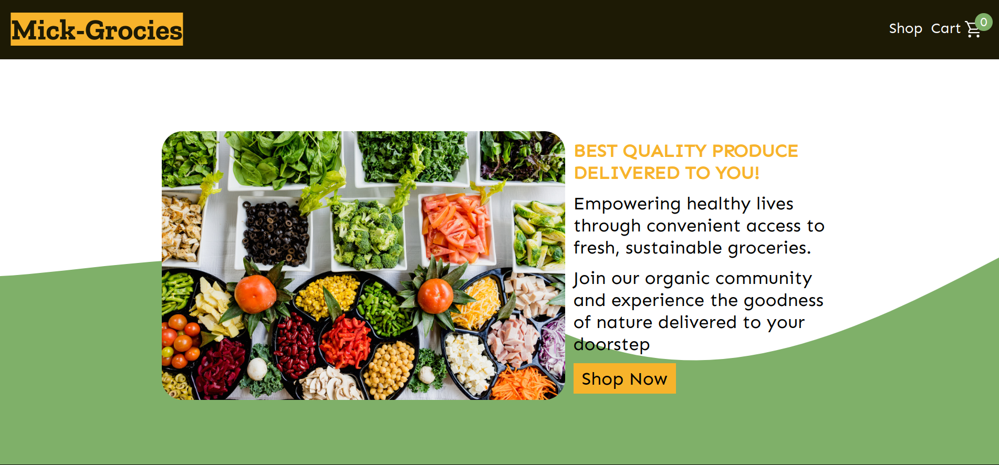
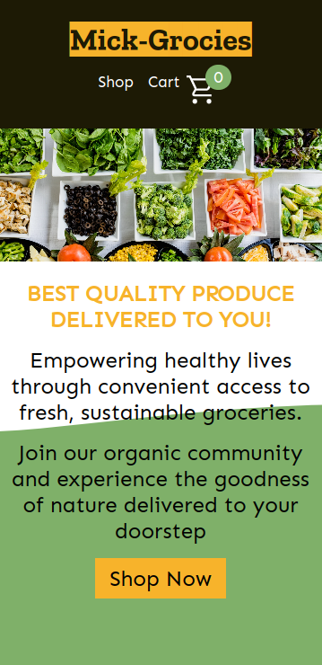

# shopping-cart

## Features

1. Single page React app with multiple pages
2. React routing to smoothly navigate web app pages
3. Shopping cart with dynamic cart to add and remove products
4. Unit testing with Jest
5. Responsiveness facilitating mobile support

## Demo

The project can be viewed live [here](https://mickfrog.github.io/shopping-cart)

## Preview

### Desktop Preview



### Mobile Preview



### Getting Started

1. Clone the repository to your local machine.

```
  git clone git@github.com:MickFrog/shopping-cart.git
```

2. navigate to containing folder

```
  cd ./shopping-cart
```

3. Install necessary dependencies

```
  npm install
```

4. Run the project on a live server from your local network

```
  npm start
```

## Image credit

### Home page and footer images

1. Veggies Image - Photo by [Dan Gold](https://unsplash.com/@danielcgold?utm_source=unsplash&utm_medium=referral&utm_content=creditCopyText)
   on [Unsplash](https://unsplash.com/photos/4_jhDO54BYg?utm_source=unsplash&utm_medium=referral&utm_content=creditCopyText)

2. Social Media Icons from [Icons8](https://icons8.com/)

### Products images

1. Milk Photo - Photo by [No Revisions](https://unsplash.com/@norevisions?utm_source=unsplash&utm_medium=referral&utm_content=creditCopyText)
   on [Unsplash](https://unsplash.com/photos/tMsuCz2DgMI?utm_source=unsplash&utm_medium=referral&utm_content=creditCopyText)

2. Eggs photo - Photo by [Kelly Neil](https://unsplash.com/@baconandbaileys?utm_source=unsplash&utm_medium=referral&utm_content=creditCopyText)
   on [Unsplash](https://unsplash.com/photos/omEpnvmwWz0?utm_source=unsplash&utm_medium=referral&utm_content=creditCopyText)

3. Bread photo - Photo by [Laura Ockel](https://unsplash.com/@viazavier?utm_source=unsplash&utm_medium=referral&utm_content=creditCopyText)
   on [Unsplash](https://unsplash.com/photos/uugOo5Lr_iM?utm_source=unsplash&utm_medium=referral&utm_content=creditCopyText)

4. Rice photo - Photo by [Darío Méndez](https://unsplash.com/@dariomen?utm_source=unsplash&utm_medium=referral&utm_content=creditCopyText)
   on [Unsplash](https://unsplash.com/photos/pvo1dnoj8tA?utm_source=unsplash&utm_medium=referral&utm_content=creditCopyText)

5. Pasta Photo - Photo by [Bozhin Karaivanov](https://unsplash.com/@bkaraivanov?utm_source=unsplash&utm_medium=referral&utm_content=creditCopyText)
   on [Unsplash](https://unsplash.com/photos/m5Ft3bsalhQ?utm_source=unsplash&utm_medium=referral&utm_content=creditCopyText)

6. Canned Beans Photo - Photo by [Antony Trivet](https://unsplash.com/@antonytrivet?utm_source=unsplash&utm_medium=referral&utm_content=creditCopyText)
   on [Unsplash](https://unsplash.com/photos/NqjH5Xp89SM?utm_source=unsplash&utm_medium=referral&utm_content=creditCopyText)

7. Chicken Photo - Photo by [JK Sloan](https://unsplash.com/@jksloan?utm_source=unsplash&utm_medium=referral&utm_content=creditCopyText)
   on [Unsplash](https://unsplash.com/photos/9zLa37VNL38?utm_source=unsplash&utm_medium=referral&utm_content=creditCopyText)

8. Beef Photo - Photo by [Kyle Mackie](https://unsplash.com/@macrz?utm_source=unsplash&utm_medium=referral&utm_content=creditCopyText)
   on [Unsplash](https://unsplash.com/photos/QH8SHBARVVk?utm_source=unsplash&utm_medium=referral&utm_content=creditCopyText)

9. Apples photo - Photo by [Kaleb Lovell](https://unsplash.com/@bananaboy12?utm_source=unsplash&utm_medium=referral&utm_content=creditCopyText)
   on [Unsplash](https://unsplash.com/photos/g4HDMoApfnw?utm_source=unsplash&utm_medium=referral&utm_content=creditCopyText)

10. Potatoes photo - Photo by [Lars Blankers](https://unsplash.com/@lmablankers?utm_source=unsplash&utm_medium=referral&utm_content=creditCopyText)
    on [Unsplash](https://unsplash.com/photos/B0s3Xndk6tw?utm_source=unsplash&utm_medium=referral&utm_content=creditCopyText)
